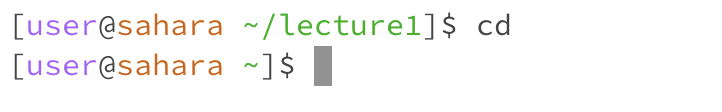
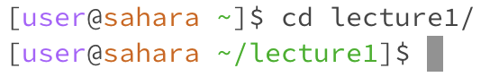
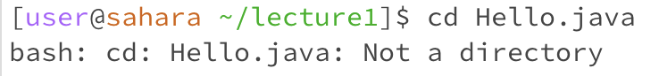
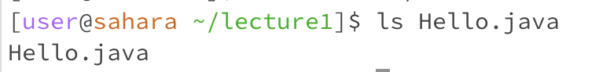
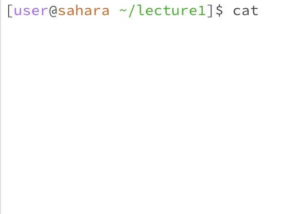
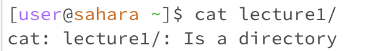
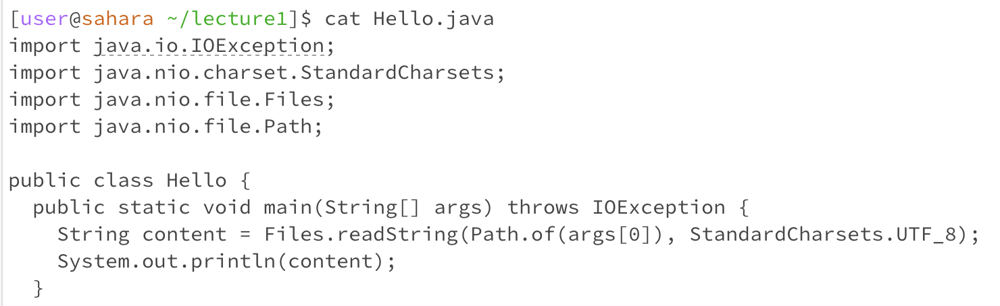
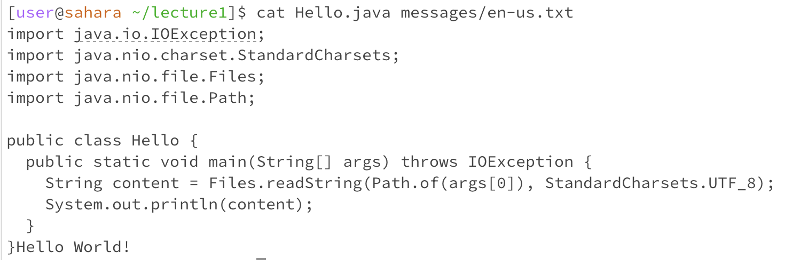

# Lab Report 1: Remote Access and File System 

This week in lab we explored basic commands `cd`, `ls`, and `cat`. 

## cd command 
The `cd` command is used to change directories. When the `cd` command is run with no arguments from the home directory it produces no output and no changes in the terminal. However, when it is run with no arguments from any other directory it returns back to the home directory, which looks like this (where [user@sahara ~] is the prompt in the terminal): 

Here, the start working directory was /lecture1 and after running the command `cd` it moved back to the home directory. This is not an error message, this is the expected output. 

In order for the `cd` command to perform appropriately, a directory needs to be specified, like so: 

Now the prompt of the terminal changed to include the /lecture1 directory the user specified. This is not an error and this output was expected to happen. The changed prompt signifies that the working directory changed from /home to /home/lecture1 and now the user has access to the files stored in /lecture1. 

But what would happen if path to a file was passed as an argument for the `cd` command? In this example we are in the /home/lecture1 directory which contains the file Hello.java: 

As you can see, an error occurred after passing a file Hello.java as an argument. In the error message it states that the argument passed into the `cd` command has to be a directory, which Hello.java is not because it's a file. 

## ls command
The `ls` command allows the user to see the list of files and folders contained in the current directory. For example, using the `ls` command while in /home/lecture1 working directory produces this output: 

This output is not an error, it is expected and performs the function that the `ls` command is meant to perform: it lists all the files and folders stored in the current directory. 

Now, if the user specifies a directory after the `ls` command, it will produce the following output: 

Here no error occured: the command completed its expected function but just listed the files and folders contained in the specified directory. Note that the current directiory of the terminal does not change in either cases. In this example, the working directory was /home and it remained /home after the completion of the command, even though it displayed files in the /home/lecture1 directory that the user specified.

However, what would happen if a file is given as an argument to the `ls` command? Here is what that output would look like, starting from /home/lecture1 directory: 

As you can see, this case just specifies the single file, the one the user stated as an argument because only that file is contained in that directory (/home/lecture1/Hello.java). This is not an error message, this is the expected output for the program. 

## cat command
The `cat` command allows the user to see the contents of specified files. If just the `cat` command with no arguments is launched from the /home directory, it will produce an infinite loop error like so: 

Since no files were specified, there is nothing for the `cat` command to display. To break out of this error, and use the terminal again, the user would have to use ^C to stop the command from trying to execute. 

Similarly, the `cat` command would produce an error if a directory was input as an argument (also from the /home directory): 

The `cat` command can only be given files as arguments in order to execute correctly. Note that this command also does not change the current directory - at the beginning and end of the execution the current directory is still /home. 

This is what a successful completion of this command would look like: 

Here the `cat` command printed out the contents of the file Hello.java. One important note to keep in mind is that the specified file has to either be in the current directory (in this example /home/lecture1) or the exact path to the file has to be specified in the argument for the command. The example above is the command running like expected, with no error. 

In fact, the `cat` command can take multiple files as arguments and it will just print their contents back to back like so: 

In this example, everything up to the "}" is from Hello.java and "Hello World!" is from the en-us.txt file. 
