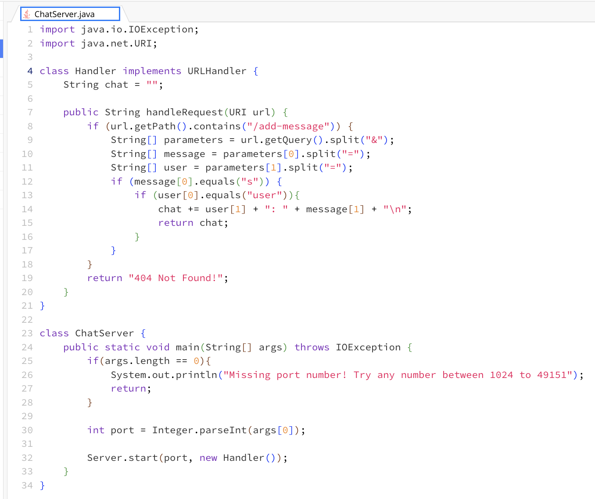
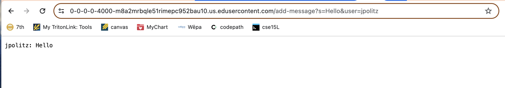
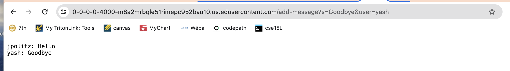
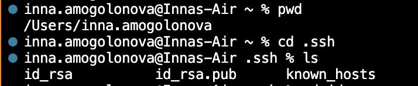
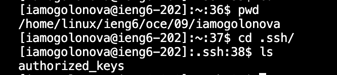
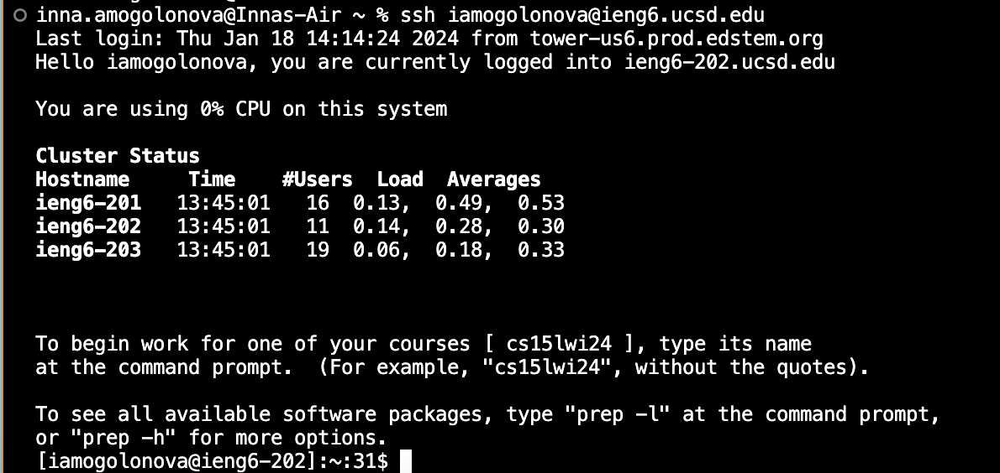

# Lab Report 2 - Servers and SSH Keys
## Part 1
In this first part of the lab report, I created a very simple web server called `ChatServer` that keeps track of a message thread specified in the URL. I modeled my ChatServer.java file after the NumberServer.java file we used in lab in order to set up the server and desired behavior correctly. 

This is what the `ChatServer` code looks like: 

Here are some examples of the behavior it produces in the browser: 

First, the `ChatServer` class gets the port number from the command line by using `Integer.parseInt(args[0])`, where `args[0]` argument is the port number specified in the terminal by us (ln 30). Then the same class calls on the class `Handler` to handle the URL of the browser (ln 32). Then the `Handler` class calls on the public method `handleRequest` which takes in a URL as a parameter. In this case the URL argument was "https://0-0-0-0-4000-m8a2mrbqle51rimepc952bau10.us.edusercontent.com/add-message?s=Hello&user=jpolitz". The `handleRequest` method parses the URL into components it can read, by first calling the `getPath()` method on the URL and then the `contains()` method to see if the URL has the "/add-message" request we are looking for (ln 8). Then, the method gets the query from the URL using the `getQuery()` method (ln 9) and then the query goes through a series of `split()` methods, taking in symbols "&" and "=" to split the URL string into its components (ln 9-11). After that, a series of `if` statements use the string method `equals()` to determine if user and message are contained in the URL (ln 12-13). Finally, the chat variable is updated to include the new user and message (ln 14) before being returned on line 15. The `message[1]` for this example is "Hello" and `user[1]` is jpolitz. The chat variable also changes in the process because it gets updated with a new chat thread. 

The process described above repeats in this example, just with slightly different arguments. The `ChatServer` class calls the `Integer.parseInt(args[0])` method and the `Handler` class. The `Handler` class calls on the public `handleRequest()` method. The URL parameter for the method in this example is slightly different, particularly at the end: "https://0-0-0-0-4000-m8a2mrbqle51rimepc952bau10.us.edusercontent.com/add-message?s=Goodbye&user=yash". Then the program goes through a series of URL handling methods and splitting methods to get to the message and user part out of the URL. Finally, it updates the chat variable again to include the new user and message, changing it from the example above. In this case, `message[1]` is "Goodbye" and `user[1]` is yash. The values of these fields got changed because they were derrived from the URL, which was edited by the us to specify yash as the new user and "Goodbye" as the new message.

## Part 2
This is the absolute path to the private SSH key on my computer, which would be /Users/inna.amogolonova/.ssh/id_rsa: 

This is the absolute path to the public SSH key on my account on `ieng6` (saved under variable name "authorized_keys"), which would be /home/linux/ieng6/oce/09/imaogolonova/.ssh/authorized_keys:

And here is me logging into my `ieng6` account without being asked for the password: 

## Part 3 
In the past two weeks in lab I learned the basics of starting and running a server. I didn't really understand how browsers and servers work before but now I know how to launch a very basic page. I also learned how to make the web page perform tasks by changing the queries on the URL. 
