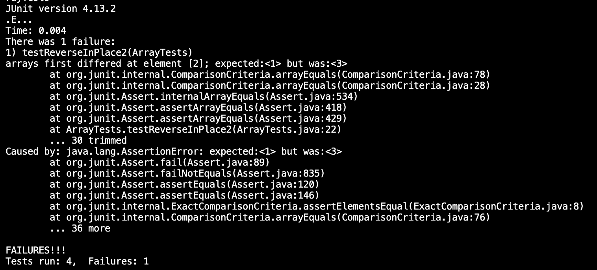

# Lab Report 3 - Bugs and Commands 
## Part 1 - Bugs 
I chose to do the Array reverseInPlace() method bug for this part of the lab. 

The failure-inducing input for the buggy method was: 
```
@Test
  public void testReverseInPlace2() {
    int[] input1 = { 1, 2, 3 };
    ArrayExamples.reverseInPlace(input1);
    assertArrayEquals(new int[] { 3, 2, 1 }, input1);
  }
```

This input did not produce a failure for the buggy method: 
```
@Test
  public void testReverseInPlace() {
    int[] input1 = { 3 };
    ArrayExamples.reverseInPlace(input1);
    assertArrayEquals(new int[] { 3 }, input1);
  }
```

This was the symptom (output of running the tests) for the buggy method: 


This was the buggy method code before the fix: 
```
static void reverseInPlace(int[] arr) {
    for (int i = 0; i < arr.length; i += 1) {
      arr[i] = arr[arr.length - i - 1];
    }
  }
```

And this is the method code after the fix: 
```
static void reverseInPlace(int[] arr) {
    for (int i = 0; i < arr.length / 2; i += 1) {
      int temp = arr[i];
      arr[i] = arr[arr.length - i - 1];
      arr[arr.length - i - 1] = temp;
    }
  }
```
The bug with reverseInPlace() method was that it reversed half of the array by bringing the last values to the front but then it lost the data of the beginning numbers. This bug was in this line: `arr[i] = arr[arr.length - i - 1];`. To fix it, I had to swap the first and last elements of the array up to the middle of the array so that no values in the array are lost. This for loop only should run to the middle of the array because if it runs further than that it will reverse the elements back to their original position. After the bug was fixed this was the JUnit Tests output: 
```
JUnit version 4.13.2
....
Time: 0.004

OK (4 tests)
```


## Part 2 - Researching Commands 
For this portion of the report I decided to research the command `find`. This command helps find things recursively in the file system by different characteristics like name, type, size and others. 

### Option 1: `-iname`
This command is similar to the `-name` option in that it helps us search commands by name but here `-iname` is case insensitive. 

```
$ find technical/911report -iname "CHAPTER*"
technical/911report/chapter-13.4.txt
technical/911report/chapter-13.5.txt
technical/911report/chapter-13.1.txt
technical/911report/chapter-13.2.txt
technical/911report/chapter-13.3.txt
technical/911report/chapter-3.txt
technical/911report/chapter-2.txt
technical/911report/chapter-1.txt
technical/911report/chapter-5.txt
technical/911report/chapter-6.txt
technical/911report/chapter-7.txt
technical/911report/chapter-9.txt
technical/911report/chapter-8.txt
technical/911report/chapter-12.txt
technical/911report/chapter-10.txt
technical/911report/chapter-11.txt
```
In the example above, the `find` command looked through the specified directory (technical/911report) and found all the files and directroies that start with the word "chapter", no matter the capitalization. 


```
$ find technical/government -iname "*con*" 
technical/government/About_LSC/Special_report_to_congress.txt
technical/government/About_LSC/CONFIG_STANDARDS.txt
technical/government/About_LSC/conference_highlights.txt
technical/government/Gen_Account_Office/InternalControl_ai00021p.txt
technical/government/Post_Rate_Comm/ReportToCongress2002WEB.txt
technical/government/Media/Weak_economy.txt
```
The example above surrounding "con" with stars will produce an input of all the paths containing the substring "con", no matter the capitalization. Also, as you can see, the output produced is not contained within only technical/govenment directory. The find command search through all the sub-directories of government/ like About_LSC and Media. 

This option was found in Source 1 listed below. 

### Option 2: `-type`
Using the `find -type` command we can specify what type of directories we want to find. Using `-type` might be useful if trying to narrow doen the search and look specifically for a directory or a file. 

```
$ find technical/government/Alcohol_Problems -type f
technical/government/Alcohol_Problems/Session2-PDF.txt
technical/government/Alcohol_Problems/Session3-PDF.txt
technical/government/Alcohol_Problems/DraftRecom-PDF.txt
technical/government/Alcohol_Problems/Session4-PDF.txt
```
In this example the `-type f` option recursively returned all the file paths in the specified directory technical/government/Alcohol_Problems. 

```
$ find technical/government -type d                 
technical/government
technical/government/About_LSC
technical/government/Env_Prot_Agen
technical/government/Alcohol_Problems
technical/government/Gen_Account_Office
technical/government/Post_Rate_Comm
technical/government/Media
```
Option `-type d` will only return the sub directories of the specified directory technical/governmnet without displaying teh files stored in them. This is useful to clear up unnecessary cluter of files if looking specifically for a directory. 

This option was found in Source 2 listed below. 

### Option 3: `-maxdepth`
Since the `find` command searched recursively through a provided directory sometimes it might be useful to limit the search to go only a certain number of subdirectories deep. You can do this using the `-maxdepth` option. 

```
$ find technical -maxdepth 1        
technical
technical/government
technical/plos
technical/base-pair.txt
technical/biomed
technical/911report
```
Since technical/ directory has a lot of subdirectories and files in it, using `-maxdepth 1` option is a good way to narrow down the search to only go one subdirectory deep. 

```
$ find technical -maxdepth 2 -type d
technical
technical/government
technical/government/About_LSC
technical/government/Env_Prot_Agen
technical/government/Alcohol_Problems
technical/government/Gen_Account_Office
technical/government/Post_Rate_Comm
technical/government/Media
technical/plos
technical/biomed
technical/911report
```
Here, using the same technical/ directory we can specify to display results 2 subdirectories deep using `-maxdepth 2`. Also we can combine options, like with `-type` from above, to narrow down the search even further, for example showing only directories 2 layers deep from the technical/ directory as seen in this example. 

This option was found in Source 1 listed below. 
### Option 4: `-empty` 
Using the `-empty` option will display empty files in the specified directory. This might be useful for tracking errors, for example if no files are supposed to be empty. 

```
$ find technical -type f -empty
technical/base-pair.txt
```
In this example, the command returns the only empty file in the directory technical/. This file is empty by mistake and now we know that this is an error that needs to be fixed. 

```
$ find technical/government -type f -empty
$
```
Calling `find -empty` on a directory with no empty files returns nothing. This is not an error message, but the expected output of this command. 

This option was found in Source 1 listed below.
#### Sources:
I used a google search "find command options" to start my research and then used the below websites that have resulted from the search. 

Source 1: [https://www.redhat.com/sysadmin/linux-find-command](https://www.redhat.com/sysadmin/linux-find-command)

Source 2: [https://tecadmin.net/linux-find-command-with-examples/](https://tecadmin.net/linux-find-command-with-examples/)
